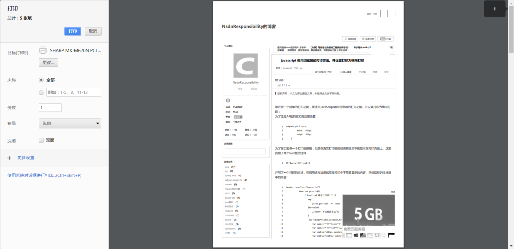
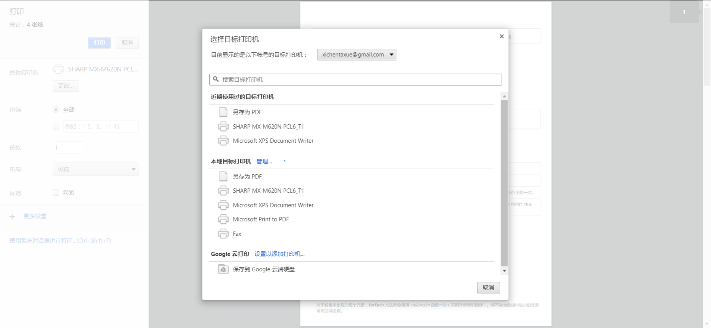
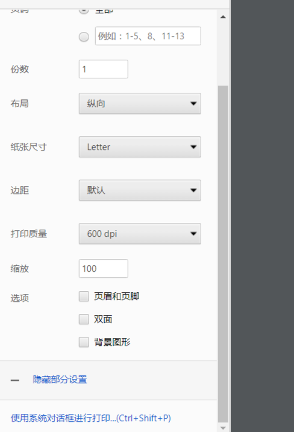

### 小白的第一次奇幻之旅

##### &emsp;&emsp; 虽然现在大部分下载打印都是后端返回的，但是前台用js的方式同样可以实现导出。主要实现方式从大体来区分可以分为两种方式：
>

## 一.直接调用浏览器的打印方法

##### &emsp;&emsp; 直接右键选择打印或者可以用代码`window.print()`直接调用浏览器的打印方法（不管哪种方法，打印a4纸大小经过测试宽为550px左右 高为880左右px，不过这里有个坑，屏幕分辨率不同，浏览器自带的打印窗口预览的高度不同，需要写媒体查询调整高度）


##### &emsp;&emsp; 点击更改可以选择打印机或者选择另存陪PDF，选择更多设置可以调整页面样式。如图所示





## 二.通过js的方式来实现

#### 1.使用jsPDF进行文本转换

```js
// 默认a4大小，竖直方向，mm单位的PDF
var doc = new jsPDF();

// 添加文本‘Download PDF’
doc.text('Download PDF!', 10, 10);
doc.save('a4.pdf');
```

##### 注：应该不支持px 要自行转换cm、mm、pt等

#### 2.使用jsPDF + html2canvas

##### 就是先使用 html2canvas 将html内容转换为canvas图片，然后用将图片插到pdf中去下载下来。

```js
var downPdf = document.getElementById("renderPdf");
     downPdf.onclick = function() {
         html2canvas(document.body, {
             onrendered:function(canvas) {

                 //返回图片dataURL，参数：图片格式和清晰度(0-1)
                 var pageData = canvas.toDataURL('image/jpeg', 1.0);

                 //方向默认竖直，尺寸ponits，格式a4[595.28,841.89]
                 var pdf = new jsPDF('', 'pt', 'a4');

                 //addImage后两个参数控制添加图片的尺寸，此处将页面高度按照a4纸宽高比列进行压缩
                 pdf.addImage(pageData, 'JPEG', 0, 0, 595.28, 592.28/canvas.width * canvas.height );

                 pdf.save('stone.pdf');

             }
         })
     }
```

## 最后一些内容

##### 1.关于分页问题：jsPDF提供了分页方法`pdf.addPage()`,自己需要设置好高度设置imgHeight;

##### 2.关于左右边距可以修改imgWidth来调整
##### 注：单位调整不好会导致严重变形


###### 注：参考https://segmentfault.com/a/1190000009211079#articleHeader1
